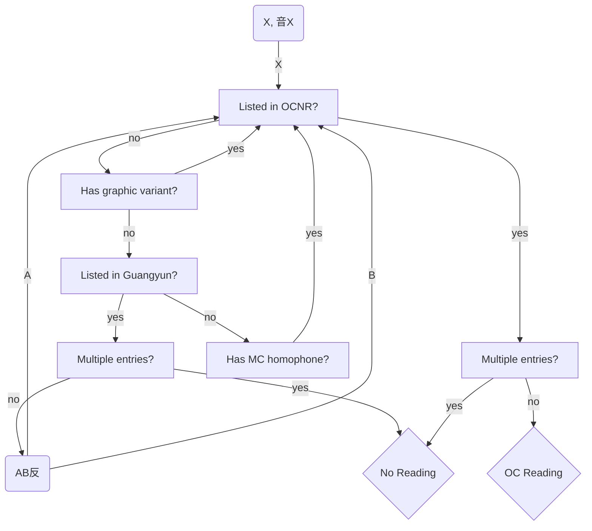

# Phonology flowchart

```mermaid
graph TD

%% nodes
yin(X, 音X)
fanqie(AB反)
ocnr[Listed in OCNR?]
guangyun[Listed in Guangyun?]
poly_oc[Multiple entries?]
poly_mc[Multiple entries?]
variant[Has graphic variant?]
mc_homophone[Has MC homophone?]
use_oc{OC Reading}
no_oc{No Reading}

%% edges
yin-->|X|ocnr
ocnr-->|no|variant
ocnr-->|yes|poly_oc
guangyun-->|yes|poly_mc
guangyun-->|no|mc_homophone
variant-->|yes|ocnr
variant-->|no|guangyun
mc_homophone-->|yes|ocnr
fanqie-->|A|ocnr
fanqie-->|B|ocnr
poly_mc-->|no|fanqie
poly_mc-->|yes|no_oc
poly_oc-->|no|use_oc
poly_oc-->|yes|no_oc
```
