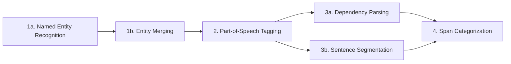

# NLP Pipeline

## Named Entity Recognition
### spaCy components
`ner`, `merge_entities`
### Problem
Classical Chinese has a mix of single-character and multi-character n-grams. In a sentence like "論語作猶", the subject of the verb "作" is "論語" (i.e. the _Analects_ writes [some character] as"猶"). To correctly identify instances where a book or person is the subject of "作", "云", etc., we need to merge multi-character tokens into single tokens. This step must come before others, like part-of-speech tagging, so that the entire word is tagged as a single noun (in this case `PROPN`).
---> GDR : this unfortunately can occur in other premodern texts (but should not happen in the JDSW)
### Assumptions
- The vast majority of multi-character n-grams present in _Jingdian Shiwen_ annotations will be either books (`WORK_OF_ART`) or people (`PERSON`).
- If we see a multi-character sequence like "論語", we can safely assume that that sequence did not occur "randomly" — that is, there's no chance that "論" or "語" should be part of other nearby context words instead.
### Approach
- Curate a preselected list of books and people that we expect to see in the corpus (see [assets/ner_patterns.jsonl](assets/ner_patterns.jsonl)).
- Use prodigy to annotate a small sample (~2000 annotations) of the corpus, with items on the list pre-selected for noting as entities.
- Train a spaCy model on the annotated data and add an `ner` component to the start of the pipeline that uses this model (step **1a**).
- Add a `merge_entities` component to the pipeline that automatically merges tokens tagged as named entities (step **1b**).
### Questions
- How should we handle cases like "本又作..." where the subject is a book, but it's not explicitly named?
- Can the model handle cases where a person is identified using their surname only? There may be nothing to merge (only a single character), but we're still interested in noting this for the purpose of network analysis.
---> GDR: This could be solved by including a step that considers which text LDM was annotating. Say "劉" occcurs in an annotation for text Y and can refer to X number of people; but for text Y only 1 "劉" provided comments, it would be safe to identify that "劉" (hence ruling out the others). For this we would have to go through LDM's postface (序) more systematically.
- Would the performance improve if the model was run later in the pipeline, when it had access to POS data? Could we do the merge step first, then later run the model to identify entities (including single-character ones)?
## Part-of-Speech Tagging
### spaCy components
`tagger`
### Problem
Classical Chinese has many homographs, which can make it difficult to determine the part-of-speech of a word without context. If we see, for example, an annotation ending in "...王也", this could be a gloss indicating either the noun "king" or the verb "to be/act as king". Verbs like "作", "云", and "也" in particular often form the backbone of annotations, but there is a risk that these same characters appear in contexts where they are not verbs. Clearly marking verbs will likely help the accuracy of other components in the pipeline.
### Approach
- Use prodigy to annotate a small sample (~2000 annotations) of the corpus, pre-labeling POS using the output of one of Koichi Yasuoka's models (UD-Kanbun or SuPaR-Kanbun).
- Train a spaCy model on the annotated data and add a `tagger` component to the pipeline (step **2**).
### Questions
- How well do Koichi's models perform on the annotations? Could we use them without any further training?
- What POS values are valid in Classical Chinese? Should we follow Koichi's lead on this?
---> GDR: POS validity depends on who we'd ask. All POS analysis for Classical Chinese is subject to interpretation and at times rather contested. If I remember correctly, Koichi has a relatively reliable system in place, and it would be easiest to test its performance first
- How should we mark the POS for components of a fanqie or "reads like" annotation?
---> GDR: "reads like" (音) could typically be identified as a verb, while the fanqie (切) would pose a larger issue; perhaps as an (intransitive) verb, it kind of marks the preceding two characters as purely metalinguistic & phonological data.
## Dependency Parsing
### spaCy components
`parser`
### Problem
Nearly all the components of annotations that we care about take the simple S-V-O form, where the subject is a book or person, the verb is transitive, and the object is a reading, gloss, or note about how a character is written. Dependency parsing will connect the subject, verb, and object of each sentence. In particular, we can ensure that in a sentence like "說文作䞓又作赬" (the _Shuowen_ writes [some character] as "䞓" and "赬"), the second "作" still has the _Shuowen_ as its subject. A side-effect of this is that we can segment annotations into sentences easily.
---> GDR: More generally, subjects can be ommitted in Classical Chinese, when the context is "obvious" (an easy solution would be to assume that ommitted subjects are the same as in the previous sentence [which is incorrect, but might function relatively well])
### Approach
- Use prodigy to annotate a small sample (~2000 annotations) of the corpus, pre-labeling dependencies using the output of one of Koichi Yasuoka's models (UD-Kanbun or SuPaR-Kanbun).
- Train a spaCy model on the annotated data and add a `parser` component to the pipeline (step **3a**).
- Enable the sentence segmentation features of the `parser` so that spaCy also sets the `doc.sents` attribute (step **3b**).
### Questions
- How well do Koichi's models perform on the annotations? Could we use them without any further training?
---> GDR: We should test this.
- What dependency values are valid for Classical Chinese? Should we follow Koichi's lead on this?
- How does the concept of a "sentence" map to the annotations in _Jingdian Shiwen_?
---> GDR: If we accept both 切 and 音 as verbs, each annotation forms a super short sentence.
## Span Categorization
### spaCy components
`spancat`
### Problem
We're interested in identifying several different components in each annotation — phonology, glosses, notes about character variation, citations, etc. The annotation "勑亮反長轂也", for example, includes both a reading ("勑亮反") and a gloss ("長轂也"). Each of these components often takes a fairly regular form, so we can use spaCy's span categorization features to assign one or several labels to each sentence or clause found by the dependency parser.
### Approach
- Curate a preselected list span patterns that are extremely well-formed — for example, fanqie (see [assets/span_patterns.jsonl](assets/span_patterns.jsonl)).
- Use prodigy to annotate a small sample (~2000 annotations) of the corpus with labels for each span (see [assets/span_labels.txt](assets/span_labels.txt)), with the above patterns pre-labeled.
- Train a spaCy model on the annotated data and add a `spancat` component to the pipeline (step **4**).
### Questions
- What kinds of spans are we interested in? How should we label them?
